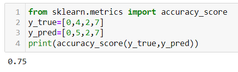
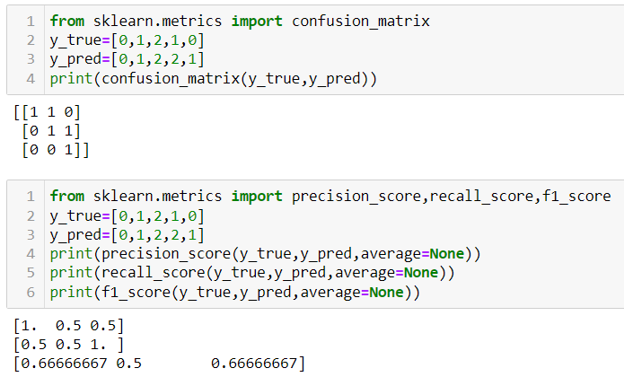
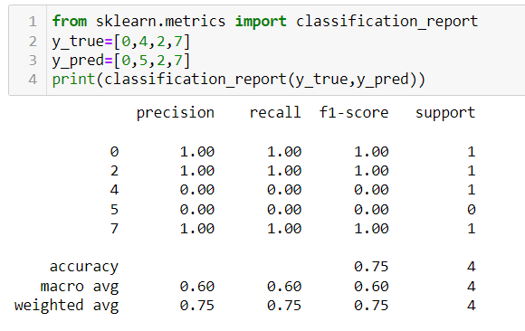
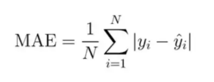
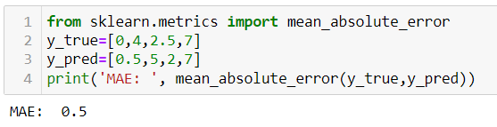
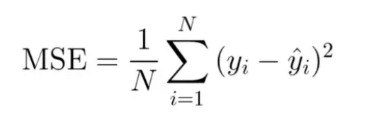
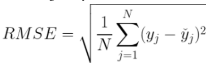
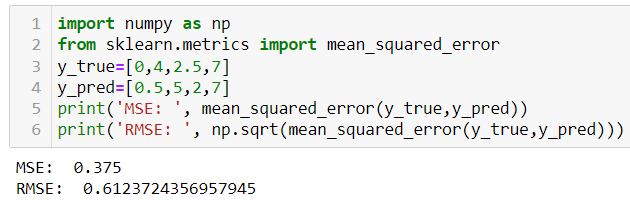
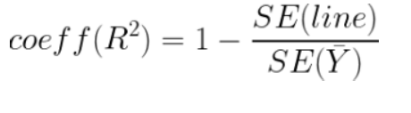
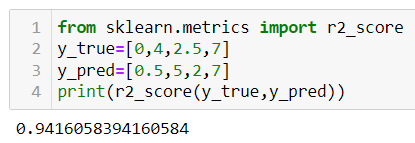

# Metrics and Performance Evaluation
The most important aspect of building models is finding its accuracy on training data using the **right** metrics. Choosing the right metric based on our need for the model and its results is very important so that we can optimize and fine tune the model’s performance as needed. 
Metrics can be broadly classified into two types depending on the type of model:
<ol>
  <li><strong>Classification Metrics</strong></li>
  Classification is one of the widely used models in Machine Learning. It mainly involves predicting classes depending on the input we have. Binary classification is the type of classification where only two classes are involved. A decision boundary is set and any value above this points to a certain class while any value below points to another value. 
Common examples of binary classification are spam detection in our inboxes, quality control in industries and medical testing (does the patient have a specific disease or not?).
There are in fact a lot of metrics we can use to evaluate the accuracy of classification models. The sklearn.metrics module has a lot of these metrics built in as functions, which is what we’ll be using today:
  <ol>
    <li><strong>Classification Accuracy</strong></li>
    This is the simplest metric which just takes the ratio of number of correct predictions to total number of predictions. This is analogous to the accuracy_score() function.
    </img>
    <li><strong>Confusion Matrix</strong></li>
  This is a function that computes the confusion matrix with each row corresponding to the true class. So it essentially is a matrix of true and false positives and negatives. Within a confusion matrix, we have multiple metrics like precision, recall and F1 score.
  <strong>Precision</strong> measures true positives over the sum of true and false positives whereas <strong>Recall</strong> measures true positives over the sum of true positives and false negatives.
  <strong>F1 score</strong> relates these two metrics and is the harmonic mean of precision and recall.
  </img>  
  <li><strong>Classification Report</strong></li>
    This conveniently builds a report with results of all the main classification labels.
    </img>
  </ol>
  <li><strong>Regression Metrics</strong></li>
  The regression model predicts continuous target values. These are different from the classification metrics because they should be able to work on continuous values.
  <ol>
    <li><strong>MAE</strong></li>
    This metric finds the average absolute distance between the predicted and target values. This metric considers the outliers better. If yi is the true value and y^i is the corresponding predicted value, then MAE is given as
    </img>
    </img>
    <li><strong>MSE</strong></li>
    This essentially finds the average squared error between the predicted and target values. It shows the deviation in the values. Outliers have a larger effect on this metric because we’re squaring the distance. If yi is the true value and y^i is the corresponding predicted value, then MSE is given as:
    </img>
    Another common metric is RMSE which is just the root of the Mean Squared Error. This handles penalization of smaller errors by taking the square root. The formula is given by:
    </img>
    </img>
    <li><strong>R squared</strong></li>
    This is a post metric i.e., a metric that is calculated using other metrics. It essentially is just a measure of what percentage of the total variation in target is explained by the regression line we plot. Closer this value is to 1, the better our model’s accuracy is.
    </img>
    Here, SE(line) is the mean squared error of the line i.e., the MSE metric whereas SE(y bar) is the mean squared of the average line (summation of difference between y and the average y value).
    </img>  
  </ol>
</ol>
