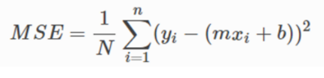
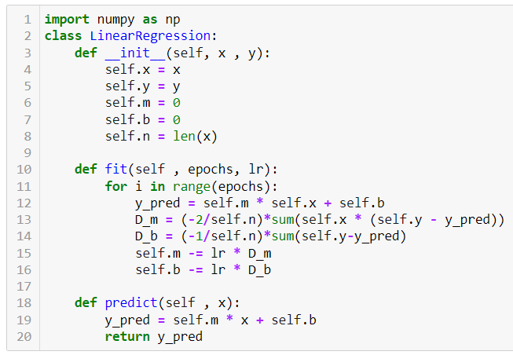
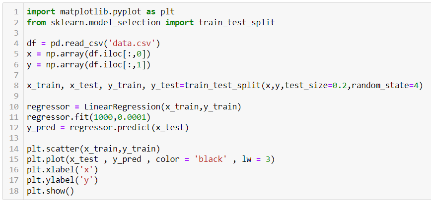
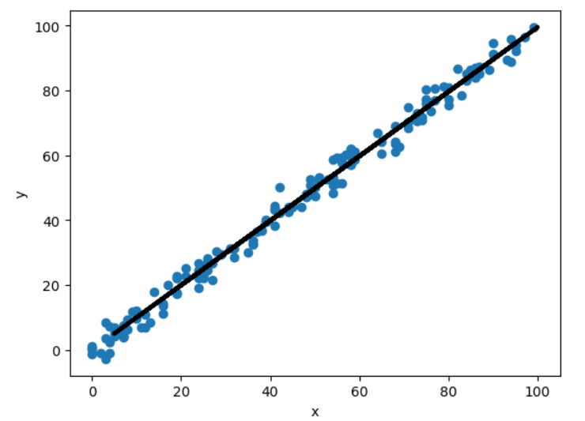
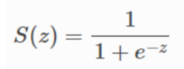
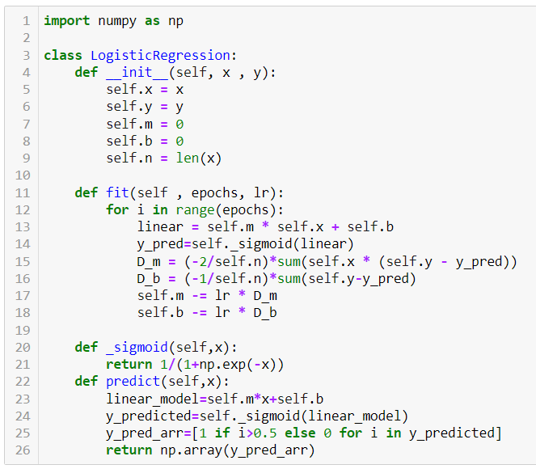
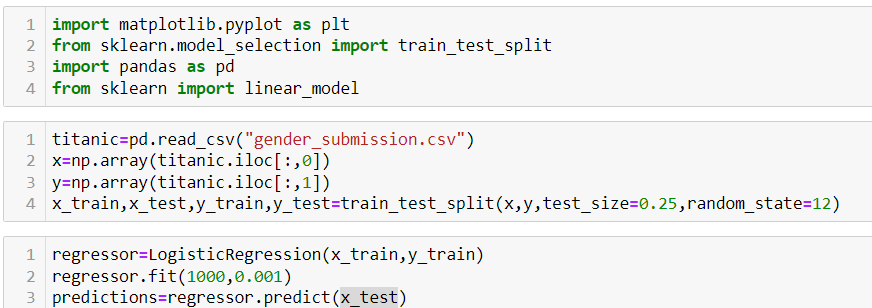
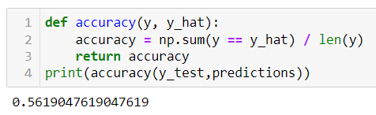

# Linear and Logistic Regression - Coding the model from SCRATCH
## Linear Regression
As we already know, linear regression is a machine learning algorithm that determines the relationship between independent and dependent variables. It models a target prediction value determined from this relationship. There are two main concepts involved in implementing this - cost function, gradient descent.

The loss function is a measure of how well the model performs. It is the difference between actual and predicted values. If we take the summation of the loss function for the entire training data, we arrive at what is known as the cost function. (essentially the same thing as MSE)
</img>
Now we calculate the gradient of this. This is done by taking partial derivatives with respect to both m and b. Keep in mind that our objective here is to decrease the error. Therefore, we have to move in the opposite direction of the gradient. The steps involved in implementing this algorithm are: 
<ol>
  <li>We first define a class LinearRegression that takes the parameters x and y (more specifically, the training data). There are two functions within this - fit() and predict()</li>
  <li>fit() takes the epochs (number of iterations) and the learning rate as parameters. We then go on to calculate the y predicted value and the partial derivatives. Then, the m and b values are updated using the learning rate and the process is repeated for the mentioned number of iterations.</li>
  <li>predict() on the other hand predicts the y value based on the testing values of x and returns it</li>
  </img>
  <li>Then we go on to import a csv file. We split the data into training and testing sets and feed the training sets into our LinearRegression class.</li>
  </img>
  <li>The graph is obtained below. The scatter plot shows all the data we have while the line represents the regression line that is obtained using the algorithm we just designed.</li>
  </img>
</ol>

## Logistic Regression
Unlike linear regression, logistic regression works using the sigmoid function to return a probability curve using the sigmoid function. This logistic function returns a probability value which then leads to either one of two discrete classes. The sigmoid function keeps all values between 0 and 1 and is given by the equation
</img>
In logistic regression, this becomes our cost function. Similar to linear, we use gradient descent to minimize the error by moving in the opposite direction of the gradient. The steps involved are:
<ol>
  <li>We first define a class LogisticRegression that takes the parameters x and y (more specifically, the training data). There are three functions within this - fit(), _sigmoid() and predict()</li>
  <li>fit() takes the epochs (number of iterations) and the learning rate as parameters. We then go on to calculate the y predicted value normally like in linear regression but then use the logistic function to convert it into a value between 0 and 1. After calculating the partial derivatives, the m and b values are updated using the learning rate and the process is repeated for the mentioned number of iterations.</li>
  <li>predict() on the other hand predicts the y value based on the testing values of x and returns it</li>
  <li>sigmoid() just takes an argument x and returns the logistic value of x.</li>
  </img>
  <li>Then we go on to import a csv file. We split the data into training and testing sets and feed the training sets into our LinearRegression class.</li>
  </img>
  <li>The accuracy is calculated by defining a function that checks the accuracy of the model, as shown below.</li>
  </img>
