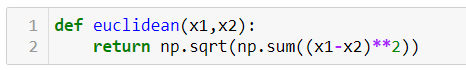

# K- Nearest Neighbor Algorithm
KNN is a supervised learning classification algorithm that makes use of proximity of other data points to make predictions. It works on the premise that data points close to each other have similar values or outcomes. 

It is both a regression and a classification problem. For us to be able to determine which data points are closest to the given point, the distance between this point and all other existing points need to be calculated. These distances will help form decision boundaries which in turn help us to partition the points into a specific region. 

Choosing the right value of K is also a very important aspect of this algorithm. To determine this, we run the algorithm several times with different values of K and choose the model that has least errors. Here, we have to note that as K increases, our predictions become more stable owing to averaging and therefore offer more accuracy.
## Implement KNN using sci-kit’s neighbors.KNeighborsClassifier for suitable dataset
This involves the following steps:
<ol>
  <li>Importing all the dependencies</li>
  </img>
  <li>The iris dataset is loaded into the variable iris as shown below</li>
  </img>
  <li>We now split the data into x and y values and store them in the respective variables</li>
  </img>
  <li>Then as per the norm, we split the data into training and testing sets</li>
  </img>
  <li>We now create an instance of the KNN model specifying the value of K</li>
  </img>
  <li>Now, we fit the training sets to the model and then go onto calculate the score of the testing values using the score() function</li>
  </img>
</ol>
## Implement KNN from scratch
This involves the understanding of the euclidean distance function which essentially just finds the summation of distance between two points squared and then takes the square root of that value.

Now the steps are outlined as follows:
<ol>
  <li>Importing all the dependencies</li>
  </img>
  <li>We define a function to calculate the Euclidean distance as shown below</li>
  </img>
  <li>Now, we go onto define a class KNN with three functions - fit, predict and _predict. Fit function stores the data we get (training values), _predict predicts single outcome for single testing inputs whereas predict puts together all these predicted outcomes and returns it.</li>
  </img>
   Here, distances computes the distance between x and all training set values. K_indices stores the list of indices of the first k neighbors sorted by distance. K_nearest_labels is extracting all the labels and the most common label is then returned using the Counter() function.
  <li>Now, we load and use the iris datasets to test it with the algorithm we built.</li>
  </img>
   Clearly, the accuracies are the same
</ol>
